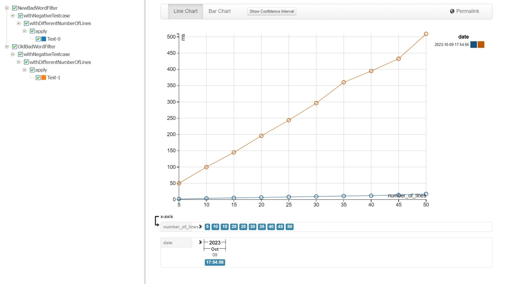
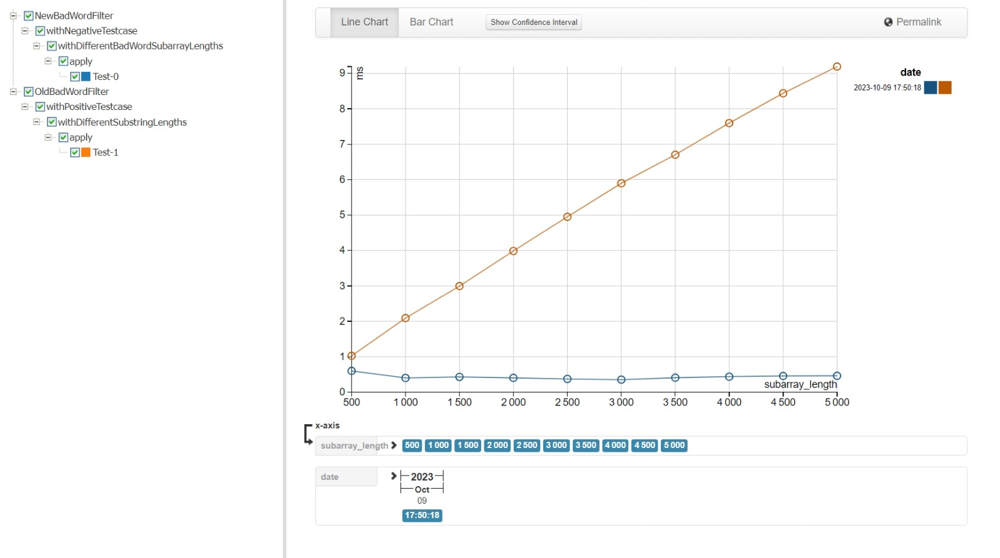

# Bad Word Filter Benchmark Results

## BadWordFilterWithoutBadWordDataAndMultipleLinesBenchmark

This benchmarks measures the performance of the implementations over varying number of lines.

Constants:
- Length of each line (5000 characters)
- Number of bad words (6400 words, ~8.44 characters per word)
- Negative test case (bad word does not exist)

Variables: 
- Number of lines (5 to 50 at intervals of 5)

Results:

## BadWordFilterWithoutBadWordAndBadWordSubArrayBenchmark

This benchmarks measures the performance of the implementations over varying number of bad words.

Constants:
- Length of each line (5000 characters)
- Number of lines (1 line)
- Negative test case (bad word does not exist)

Variables:
- Number of bad words (500 to 5000 words at intervals of 500)

Results:

